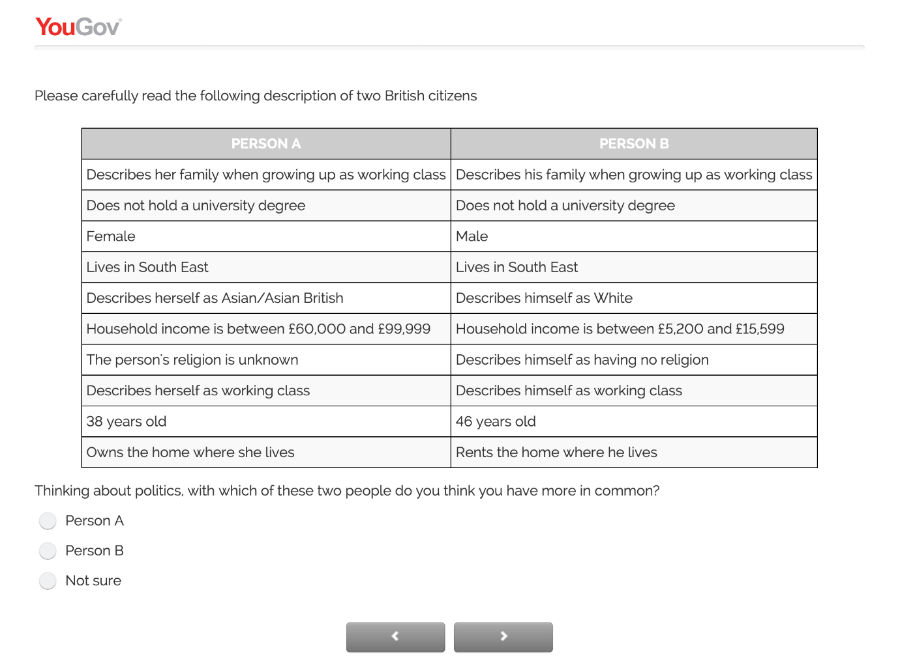

```{r,include=FALSE}

library(knitr)
knitr::opts_chunk$set(eval = TRUE, echo = FALSE, message=FALSE, warning=FALSE)
library(kableExtra)
library(MASS)
library(DescTools)
library(survey)
library(dplyr)
library(ggplot2)
library(ggthemes)
library(gridExtra)
library(ggthemes)
library(plotrix)
library(plyr)
#library(sjPlot)
library(coefplot)
library(questionr)
library(psych)
library(snakecase)
library(questionr)
#library(sjmisc)
library(coefplot)
library(stargazer)
library(tidyr)
library(forcats)
library(stringr)
library(readr)
library(tidyverse)
library(glue)
library(papaja)

fadecol <- function(col,alpha){
    components <- col2rgb(col)
    return(rgb(components[1,]/255,components[2,]/255,components[3,]/255,alpha=alpha))
}


CovInteraction <- function(m1, x) {
  vcov_2 <- vcov(m1) %>%
    data.frame() %>% 
    tibble::rownames_to_column("term")
  vcov_x <-vcov_2 %>%
    dplyr::filter(str_detect(term, glue("{x}")))
  vcov_x <-bind_rows(vcov_x[,c("term",x)])
  colnames(vcov_x)[colnames(vcov_x)==x] <- "Covariance"
  return(vcov_x)
}

load("CleanDataExperiment2")

```

# Introduction
Electoral results are often analysed in terms of the demographic attributes of each party’s electorate. Frequently, these analyses seek to show more than mere descriptive associations. One mechanism by which these associations could arise is through the politicization of social identities [e.g. @campbell1960american;@huddy2001social]. Social identity theory [@tajfel1974social;@tajfel1979integrative] argues that a person’s demographic attributes and the feelings that person has towards these categories may provide an essential part of that individual's identity.
However, analysing the associations between demographic groups and voting does not reveal the relative importance of the corresponding social identities to politics. How can we determine which social identities are more important for how people perceive political commonality between themselves and other citizens?

This research study makes novel contributions to our understanding of social identities in politics and to the methodology with which we study them. Respondents for this study were taken from the pool of regular respondents in the British Election Study (BES) on-line panel. All demographic variables for the respondents to the experiment were thus measured in surveys completed before the experiment. The experiment consisted in presenting two profiles with 10 demographic attributes. Respondents were then asked to choose, in terms of politics, with which of the two they perceived they had more in common. These two profiles were themselves sampled from the British Election Study, ensuring that the two citizen profiles which respondents were assessing for relative political commonality are representative of the actual characteristics of British citizens across the full experiment. This method relates to traditional conjoint experiments, but Instead of a distribution where profile attributes are independently randomised I have randomly selected complete profiles following their actual distribution in the population.

<!--The experiment was fielded by *YouGov* between June and August 2019. The prompt was presented five times per respondent with different profiles each time. The order in which the attributes were listed was randomized per respondent. 1656 respondents from Great Britain were recruited for the experiment (8.280 responses). In the analyses, I use sample weights provided by *YouGov* that make the data representative of the British population on standard demographic and past vote variables.-->

The study introduces a new approach to the measurement of social identities and their politicization. The previous reliance on the association between demographic attributes and electoral results to assess the relevance of social identities confounds the fact that group membership is different from social identity and some social identities may be relevant for the population's perception on political commonalities even if they are not being mobilized by the political parties, while other social identities may predict voting behaviour well without playing an important role in individuals' perceptions of politics. This approach re-orients analysis of social identity in politics away from asking which demographic characteristics most strongly predict shared behaviour (e.g. voting) towards asking which social identities cause people to see that their fellow citizens as potential allies in politics.

# Social and Political Identity

The tradition of social identity theory and inter group relations was established by @tajfel1974social and further developed in @tajfel1979integrative. This theory argues that a person’s social category (such as class, religion, or ethnicity) and the feelings that person has towards that category provide a “self-definition that is a part of the self- concept. People have a repertoire of such discrete category memberships that vary in relative overall importance in the self- concept” [@hogg1995tale, p. 259]. This original perspective of social identity is complemented by the notion of “self-categorization” [@turner1987rediscovering]. The self-categorization element of social identity is the cognitive process by which a person highlights differences from out-group individuals and similarities to in-group individuals. In other words, group identity emerges as a feeling of similarity to the “typical member” or prototypical group member [@huddy2013group].

Membership in a social group is a necessary but not sufficient condition for the emergence of social identity, and social identity is a necessary but not sufficient condition for political identity. @huddy2013group defines political identity as “a social identity with political relevance” (739).
Following this definition, for group membership to become a political identity two elements must be present. First,  the presence of salient social identity is required [@huddy2001social;@huddy2013group] and, second, this identity must rest on “political content” [@huddy2013group, p.739].

One implication of this definition is that, as @egan2020identity has argued, these identities are not merely antecedent to political attitudes. Rather political contexts can affect them, especially through social sorting [@mason2015disrespectfully; @mason2018uncivil]. The aim of this study is to operationalize an analysis of this phenomenon by identifying which social identities are more relevant in terms of perceived political commonalities.

When social identities are measured directly comparisons of the relative salience of these identities tend to be difficult. This is partly a methodological issue, as many studies of competing social identities rely on direct one item questions, without measuring relative strength [e.g. @evans2016social]. Social identity measurements in nationally representative surveys have been criticized, among other reasons, for not adequately measuring intensity of identification [@huddy2013group; @wong2010boundaries], therefore making comparisons between different identities virtually impossible. On the other hand, more complex multi-item measurements, with identity scales, are typically designed for specific social groups, making comparisons across multiple dimensions of identity hard. For example, even the widely used Multigroup Ethnic Identity Measure (MEIM), developed by @phinney1992multigroup is designed for comparisons only among individuals and groups in ethnic terms. 
<!--Underlying the social and political grouping is the notion that political identities stem from the social identities that people consider politically relevant. As people hold several different social identities, the question of political relevance is not trivial. For example, [@converse1964nature] pointed out to the competing relevance of class and religious identity for political grouping in the US.  Additionally, there are reasons to presume that social distance perception depends on the interaction of several social identity attributes, rather than simply one. For instance, religious service attendance may be associated with aversion to interracial romance [e.g. @perry2014more]. -->

## Social Identities in Britain

A persistent debate about competing social identities in western democracies has revolved around the importance of social class in politics.  A long line of research has shown a historical relationship between social class membership and voting behaviour in the Anglo-American context [e.g. @alford1967class] and in Europe [e.g. @houtman2009farewell;@jansen2013classa]. Additionally, as several studies have focused their attention on other characteristics of the European population that may explain electoral behaviour, the importance of ethnicity [e.g. @zick2008ethnic], age [e.g. @maggini2016young] and education [e.g. @ford2020changing] in predicting political attitudes and behaviours have become increasingly prominent. Some have claimed that these new demographic patterns are the result of new emerging social cleavages that have replaces the old class divide [@marks2017dealignment; @stubager2010development].
<!--
More recent theories have analysed the way these links have come to exist in the context of the emergence of social democratic parties. As Prezowrski wrote in 1985, Social Democratic parties emerged from the electoral dilemma of socialism which implied that: “socialists must choose between a party homogenous in its class appeal but sentenced to perpetual electoral defeats and a party that struggles for electoral success at the cost of diluting its class character” (24). This effort to expand the parties’ appeal beyond the working class usually takes the form of a “…trade-off between the recruitment of middle classes and of workers” [@przeworski1986capitalism,  p.106]. This is manifested in changes in the party image, which de-emphasizes class struggle, and replaces its party image as “the party of workers” to become the party of “the masses, the people, the nation, the poor, or simply…citizens” (p. 27). 
-->

In this broader context I have focused on the British case because of its interest as an example of the general trend described above. The relevance of class for political outcomes and party identity in the UK has a long tradition [@butler1969stokes;@butler1971political]. However,  even if class has maintained its status as an important social identity in Britain [e.g. @evans2017new], several studies have shown it has become less salient in politics. Some see this as owing to changes through which the parties have become less aligned with social class identity without social class identity being less salient to individuals [e.g. @evans2017new; @heath2015policy].  This study, by focusing on respondents' sense of commonality with other people, sets aside the question of whether the parties are providing a social class salient choice, and focuses on whether citizens feel their social class is important. 

Additionally, this study was carried out in the context of the Brexit debates, following the EU referendum of 2016. Specifically, the data for the study was collected shortly after the European Parliament elections of May 2019, in which the Brexit party became the largest party with 29 seats. Brexit and the debates it sparked may have brought upon the emergence of new political identities and “these new identities reflect pre-existing but less politicized social divisions…” [@hobolt2020divided, 3]. For example, @sobolewska2020brexitland find ethnocentrism may have played a pivotal role in the Brexit vote. This perspective on the shifting importance of social identities for political behaviour in Britain is also strengthened by the fact that in the 2017 General Election age replaced class as main predictor of party choice [@sloam2019youthquake].
 

<!--One reason the previous debate is somewhat convoluted is that the definitions of social class differ widely.  From a strict occupational definition, based on the National Statistic Socio-Economic Classification (NS-SEC) adopted by the Office of National Statistics, to the complex definition, based on Bourdieu’s -@bourdieu1984distinction cultural definitions of class. In this latter definition, the most well-known version is the one proposed by Savage et al. (2015), in which social class combines occupation with education, geography, housing tenure, and other cultural attributes. 

Additionally, Most of the discussion on relative political importance of social identities comes from models predicting vote through group membership. First,-->


# Data and Methods

This paper presents a novel measurement strategy for assessing the relative salience of social identities for perceived political commonalities. Respondents were presented with two randomly selected profiles of fellow citizens, characterized with 10 demographic categories frequently considered as determinants of voting behaviour. Respondents were then asked to assess, in terms of politics, with which of the two profiles they perceived they had more in common. An example of how this appeared to respondents can be seen in Figure \@ref(fig:PromptChunk).

The format of previous studies on the political relevance of social identities encourages respondents to think of demographic characteristics one at a time. In contrast, this design requires respondents to evaluate each attribute in the context of many at once, which means that there is an implicit trade-off between the different attributes. Additionally, because the task requires respondents to evaluate profiles with several attributes simultaneously, there is less risk of social desirability bias or conflating identity with sympathy. The fact that the prompt explicitly asks for political commonalities, rather than general closeness, comes from the definition of political identity as a "social identity with political relevance" [@huddy2013group, p.739]. 

The profiles of characteristics presented to respondents were profiles of real people who were randomly selected from the respondents of the 2017 post-election BES. The randomization was carried out in a probability proportional to size (PPS) manner, with the probability of sampling proportional to the 2017 General Election turn-out weights. This meant that the profiles presented to respondents followed the distribution of British voters.  This is important because it ensures that not only the distribution of individual characteristics is realistic, but also the (joint) distribution of combinations of characteristics is realistic.  If an arbitrary distribution had been used, the relative magnitude of the coefficients on different similarities could have reflected those arbitrary aspects of how different characteristics were put together in the experiment.  The experiment, as designed, asks the question of how people choose which of two people is closer to them politically, where those two people are sampled from Great Britain's voting population rather than from a distribution made up by the experimenter.

This method is closely related to traditional conjoint experiments [@bansak2020conjoint], however, instead of a distribution where profile attributes are independently randomised, I have randomly selected complete profiles following their actual distribution in the population. Because the estimates derived from conjoint experiment are obtained averaging over the treatment distribution, using this external benchmark for the distribution helps with external validity of estimates  but implies I cannot use non-parametric identification of causal effects of individual attributes, introducing model dependence in the analysis of the data [@delacuesta2019improving].

The profiles' characteristics included in the study were: gender, age, religion, region, home status, education, annual household income, subjective class, and subjective family class. The possible levels for each characteristics are detailed in Table 1 in the online appendix. The experiment was fielded by *YouGov* between June and August 2019. The prompt was presented five times per respondent with different profiles each time. The order in which the attributes were listed was randomized per respondent. 1656 respondents from Great Britain were recruited for the experiment (8,280 responses). In the analyses, I use sample weights provided by *YouGov* that make the data representative of the British population on standard demographic and past vote variables[^DetailesLevels].

[^DetailesLevels]: Further details on the levels of each category and their distribution among repondents and experiment profiles, are given in the online appendix.

```{r PromptChunk, echo=FALSE,out.width="98%",fig.cap="Survey prompt with example profiles.",fig.show='hold',fig.align='center', fig.pos="H"}

``` 

To analyse the results of the experiment, the information on the respondents’ self-categorization is combined with that of the profiles presented to them and their choices. The analysis seeks to assess the probability of a respondent choosing one profile if that profile shares an attribute with the respondent, while the other alternative profile does not.

To perform this analysis, two dummy variables, $m_{Aij}$ and $m_{Bij}$, are created to reflect whether the respondent’s self-categorization on task $i$, matches profile $A$ on attribute $j$ and whether it matches profile $B$ on the same attribute $j$ (two dummy values per iteration per attribute). The difference between the two dummy variables is the explanatory variable of interest, $d_{ij} = m_{Aij}-m_{Bij}$. If, for task $i$, the two profiles present the same levels as the respondent on attribute $j$, or neither of them do, $d_{ij}$ will be zero. If the matching attribute is only 1 in the first person (“Person A”), then $d_{ij}$ will have the value of positive 1. If the matching attribute is only 1 in the second person (“Person B”), then $d_{ij}$ will have the negative value of -1. The choice of the respondent for task $i$, the outcome of interest, $c_i$, is then coded in an equivalent way, with 1 meaning the respondent chose Person A, -1 meaning that the respondent chose Person B, and 0 meaning the person chose “not sure”. The reason the data is coded this way is that this means that matches with A and B are treated symmetrically, and each coefficient describes the effect of moving from no match to match for a single characteristic, holding the other attributes and the other profile constant.

With these variables, the following subsections will examine how important is every $d_{ij}$, for every attribute $j$ in explaining the respondents' choice ($c_i$). I will then examine if this relative importance of the attributes varies by respondents’ past political behaviour (electoral choice in the 2017 General Election and the EU referendum).


\newpage


# Relative importance for political commonality of each social category
The results of regressing respondents’ choice explained by the relative matching attributes in an ordinal logistic model [^linearequivalent] are presented in Figure \@ref(fig:FirstPlot). The coefficients correspond to how strongly a respondent matching a profile on a given attribute predicts the respondent choosing that profile as having more political commonality with herself. 
All the matching coefficients are statistically significant at the 95% confidence level. This confirms that, on average, people are more likely to feel political commonality with people who share their social identity categories, for all the characteristics in the study. 

Because the levels of the different attributes are correlated, both among respondents and among profiles, the matching variables are correlated. Thus, the inclusion of several economic variables could dilute the strength of class matching when compared to ethnicity, due to collinearity. To confirm how robust the estimates a regression model including all attributes and ten regression models including each single attribute are presented in Figure \@ref(fig:FirstPlot), which shows that the described trends remain largely unchanged.

Overall, this first analysis points to the importance of ethnicity for political commonality. Age, education, and matching subjective class, while playing some role in perceived political commonality, seem to do so to a lesser extent. The same is true for the different attributes related to class, such as home status, income, and subjective family class. 

[^linearequivalent]: The results are largely unchanged with a linear model as can be seen in Figure 6 in the online appendix.

```{r regression_no_interaction_Chunk,include=FALSE}
Homophily.model.ordinal <- polr(ChoiceNFactor~Match.GenderD+Match.EducationD+Match.subClassD+Match.subFamClassD+Match.HomeStatusD+
                                  Match.regionD+Match.religionD+Match.ethnicityD+Match.incomeD+Match.AgeGroupD
                                , weights=data.experiment2.Second$W8, data = data.experiment2.Second)
Homophily1 <- coef(summary(Homophily.model.ordinal)) %>%
  data.frame() %>% 
  tibble::rownames_to_column("term")
Homophily1 <- Homophily1[-c(11,12),]
glimpse(Homophily1)


Homophily1<- Homophily1 %>%
  mutate(term = dplyr::recode(term, "Match.AgeGroupD" = "Age", "Match.EducationD" = "Education",
                              "Match.ethnicityD" = "Ethnicity", "Match.incomeD" = "Income", "Match.GenderD" = "Gender",
                              "Match.HomeStatusD" = "HomeStatus", "Match.regionD" = "Region",
                              "Match.religionD" = "Religion", "Match.subClassD" = "Subjective class",
                              "Match.subFamClassD" = "Subjective family Class"))
Homophily1 <- Homophily1 %>%
  mutate(term = fct_rev(term))

P.Homophily.1<-ggplot(Homophily1, aes(x=term, y=exp(Value))) + 
  geom_errorbar(aes(ymin=exp(Value-2*Std..Error), ymax=exp(Value+2*Std..Error)), width=.1) +
  geom_point(shape=19, size=2, alpha=0.7) +
  geom_hline(yintercept=1, linetype="dashed", 
             size=1, color="blue", alpha=0.5)+
  theme_clean()+ 
  ggtitle("Political commonality for each social category. Multivariate Model (odds ratio)") +
  theme(plot.title = element_text(hjust = 0.5, face = "plain")) +
  xlab("") + ylab("")+
  coord_flip(ylim = c(-1, 3))+
  theme(legend.position = "none")

```


```{r regression_one_at_a_time, include=FALSE}


One_At_A_Time <- function(varind){
  model<- polr(paste("ChoiceNFactor~",varind),
                                   weights=data.experiment2.Second$w8, data=data.experiment2.Second, Hess = T )
  M<-data.frame(coef(summary(model))[1,1])
  M[1,2]<-data.frame(coef(summary(model))[1,2])
  rownames(M)[1]<-varind
  colnames(M)[1]<-"Value"
  colnames(M)[2]<-"Std. Error"
  return(M) 
}


OneAtTime<-data.frame(matrix(NA, 10,2))
rownames(OneAtTime)<-c("Match.GenderD", "Match.EducationD", "Match.subClassD", "Match.subFamClassD", "Match.HomeStatusD",
                       "Match.regionD", "Match.religionD", "Match.ethnicityD", "Match.incomeD", "Match.AgeGroupD")
for (i in rownames(OneAtTime)){
  OneAtTime[i,1:2]<-  One_At_A_Time(i)
}
colnames(OneAtTime)[c(1,2)]<-c("Value","Std.Error")
OneAtTime<- OneAtTime %>%
  tibble::rownames_to_column("Name")
OneAtTime<- OneAtTime %>%
  mutate(Name = dplyr::recode(Name, "Match.AgeGroupD" = "Age", "Match.EducationD" = "Education",
                              "Match.ethnicityD" = "Ethnicity", "Match.incomeD" = "Income", "Match.GenderD" = "Gender",
                              "Match.HomeStatusD" = "HomeStatus", "Match.regionD" = "Region",
                              "Match.religionD" = "Religion", "Match.subClassD" = "Subjective class",
                              "Match.subFamClassD" = "Subjective family Class"))

P.OneAtTime.1<-ggplot(OneAtTime, aes(x=Name, y=exp(Value))) + 
  geom_errorbar(aes(ymin=exp(Value-2*Std.Error), ymax=exp(Value+2*Std.Error)), width=.1) +
  geom_point(shape=19, size=2, alpha=0.7) +
  geom_hline(yintercept=1, linetype="dashed", 
             size=1, color="blue", alpha=0.5)+
  theme_clean()+ 
  ggtitle("Political commonality for each social category. Bivariate models (odds ratio)") + theme(plot.title = element_text(hjust = 0.5, face = "plain")) +
  xlab("") + ylab("")+
  coord_flip(ylim = c(-1, 3))+
  theme(legend.position = "none",
        strip.text.y = element_blank(), panel.background = element_rect(fill="#00000000"))+
  facet_grid(Name~., scale="free", space= "free")

```

```{r FirstPlot, fig.width=9,fig.height=8,out.width="\\linewidth",echo=FALSE,fig.cap="Percieved political commonality by social identity. Multivariate regression (top) and one variable at a time (bottom)",fig.show='hold',fig.align='center', fig.pos="H"}
grid.arrange(P.Homophily.1, P.OneAtTime.1, nrow=2)

```

# Social identity, perceived political commonality, and vote choice
Does perceived political commonality depend on different attributes for Conservative versus Labour voters, or Leave versus Remain voters? The relationship between perceived political commonality and vote choice is analysed by including the corresponding interaction effects in the regression model.
As Figure \@ref(fig:Polit-by-PartyandEU-Chunk) shows, the importance of ethnicity differs by party and referendum vote to a degree unmatched by any other attribute. Specifically, Conservative and Leave voters give significantly more weight to this aspect for perceived political commonality, compared to Labour and Remain voters. 
These findings suggest that ethnicity might have become a politicized social identity, and that the demographic association between the ethnic self-categorization of a respondent and vote choice is not the result of mere policy preferences. In the online appendix, Figure 7 shows the interactive effect of party vote and EU referendum vote. Labour voters who voted Leave give a similar weight to ethnicity to both Conservative Leave and Remain voters.  While the large confidence interval warrants caution, these patterns are consistent with @hobolt2020divided findings of Brexit politicizing social identities, such as ethnicity, that escape the traditional party divisions. 

```{r regression_politics_interaction, include=FALSE}
data.experiment2.Second<-data.experiment2.Second %>%
dplyr::  mutate(pastvote_party = recode_factor(pastvote_2017, Conservative  = "Conservative",
                                     Labour = "Labour",
                                       .default=NA_character_))
Homophily.Party.ordinal<- polr(ChoiceNFactor~Match.GenderD*pastvote_party+Match.EducationD*pastvote_party+
                             Match.subClassD*pastvote_party+Match.subFamClassD*pastvote_party+Match.HomeStatusD*pastvote_party+
                             Match.regionD*pastvote_party+Match.religionD*pastvote_party+Match.ethnicityD*pastvote_party+
                             Match.incomeD*pastvote_party+Match.AgeGroupD*pastvote_party,
                            weights=data.experiment2.Second$W8, data = data.experiment2.Second)

data.experiment2.Second<-data.experiment2.Second %>%
  mutate(pastvote_Brexit = recode_factor(pastvote_EURef, "I voted to Remain"  = "Remain",
                                  "I voted to Leave" = "Leave",
                                  .default=NA_character_))
Homophily.Brexit.ordinal<- polr(ChoiceNFactor~Match.GenderD*pastvote_Brexit+Match.EducationD*pastvote_Brexit+
                              Match.subClassD*pastvote_Brexit+Match.subFamClassD*pastvote_Brexit+Match.HomeStatusD*pastvote_Brexit+
                              Match.regionD*pastvote_Brexit+Match.religionD*pastvote_Brexit+Match.ethnicityD*pastvote_Brexit+
                              Match.incomeD*pastvote_Brexit+Match.AgeGroupD*pastvote_Brexit
                            , weights=data.experiment2.Second$W8, data = data.experiment2.Second)

#Interaction with party


#Function to extract covariances


Cov.Education<-CovInteraction(Homophily.Party.ordinal, "Match.EducationD")
Cov.Ethnicity<-CovInteraction(Homophily.Party.ordinal, "Match.ethnicityD")
Cov.Home<-CovInteraction(Homophily.Party.ordinal, "Match.HomeStatusD")
Cov.Gender<-CovInteraction(Homophily.Party.ordinal, "Match.GenderD")
Cov.Region<-CovInteraction(Homophily.Party.ordinal, "Match.regionD")
Cov.Religion<-CovInteraction(Homophily.Party.ordinal, "Match.religionD")
Cov.Class<-CovInteraction(Homophily.Party.ordinal, "Match.subClassD")
Cov.Age<-CovInteraction(Homophily.Party.ordinal, "Match.AgeGroupD")
Cov.Income<- CovInteraction(Homophily.Party.ordinal, "Match.incomeD")
Cov.FamilyClass <- CovInteraction(Homophily.Party.ordinal, "Match.subFamClassD")

Homophily3 <- coef(summary(Homophily.Party.ordinal)) %>%
  data.frame() %>% 
  tibble::rownames_to_column("term")
#vcov_2 <- vcov(Homophily.Party.ordinal) %>%
#  data.frame() %>% 
#  tibble::rownames_to_column("term")


Covariances<-rbind(Cov.Education, Cov.Ethnicity,
                   Cov.Home, Cov.Gender, Cov.Region, Cov.Religion, Cov.Class,Cov.FamilyClass, Cov.Age, Cov.Income)


InteractionIdentityP<- left_join(Covariances, Homophily3, by = "term")  

InteractionIdentityP<- InteractionIdentityP %>%
  mutate(term, term = str_replace(term,"Match.GenderD:pastvote_partyLabour", "pastvote_partyLabour:Match.GenderD"))
InteractionIdentityP<- InteractionIdentityP %>%
  mutate(term, Coefficient = str_glue("Conservative:{term}"))
InteractionIdentityP<- InteractionIdentityP %>%
  mutate(term, Coefficient = str_remove(Coefficient,"Conservative:pastvote_party"))           
InteractionIdentityP<- InteractionIdentityP %>%
  mutate(term, Coefficient = str_remove(Coefficient,"Match."))
InteractionIdentityP<- InteractionIdentityP %>%
  mutate(term, Coefficient = str_remove(Coefficient,"D")) 

#Obtain coefficents

InteractionIdentityCoefP<- InteractionIdentityP %>%
  dplyr::select(Coefficient, Value)
InteractionIdentityCoefP<- InteractionIdentityCoefP %>%
  tidyr::separate(col=Coefficient, into=c("type","Coefficient"))
InteractionIdentityCoefP<- InteractionIdentityCoefP %>%
  tidyr::spread(type, Value, convert=T)

InteractionIdentityCoefP<- InteractionIdentityCoefP %>%
  mutate(Labour= InteractionIdentityCoefP$Conservative + InteractionIdentityCoefP$Labour)

#Obtain standard errors

InteractionIdentityCovP<- InteractionIdentityP %>%
  dplyr::select(Coefficient, Covariance)
InteractionIdentityCovP<- InteractionIdentityCovP %>%
  tidyr::separate(col=Coefficient, into=c("type", "Coefficient"))
InteractionIdentityCovP<- InteractionIdentityCovP %>%
  tidyr::spread(type, Covariance, convert=T)
InteractionIdentityCovP<- InteractionIdentityCovP %>%
  dplyr::rename("Conservative.Cov00"= "Conservative" ,
                "Labour.Cov01" ="Labour")

InteractionIdentitySEP<- InteractionIdentityP %>%
  dplyr::select(Coefficient, Std..Error)
InteractionIdentitySEP<- InteractionIdentitySEP %>%
  tidyr::separate(col=Coefficient, into=c("type", "Coefficient"))
InteractionIdentitySEP<- InteractionIdentitySEP %>%
  tidyr::spread(type, Std..Error, convert=T)
InteractionIdentitySEP<- InteractionIdentitySEP %>%
  dplyr::rename("Conservative.SE"= "Conservative" ,
                "Labour.SE" ="Labour")

InteractionIdentitySE.tidyP<- left_join(InteractionIdentitySEP, InteractionIdentityCovP, by = "Coefficient")
InteractionIdentitySE.tidyP[,3]<-InteractionIdentitySE.tidyP[,3]^2
InteractionIdentitySE.tidyP[,5]<-InteractionIdentitySE.tidyP[,5]*2
InteractionIdentitySE.tidyP<- InteractionIdentitySE.tidyP %>%
  mutate(Labour.SE=
           sqrt( InteractionIdentitySE.tidyP$Conservative.Cov00 +InteractionIdentitySE.tidyP$Labour.SE + InteractionIdentitySE.tidyP$Labour.Cov01))


#Tyding up

InteractionIdentitySE.tidyP <- InteractionIdentitySE.tidyP %>%
  dplyr::select( "Name"=Coefficient, ends_with("SE"))
InteractionIdentitySE.tidyP <- InteractionIdentitySE.tidyP %>%
  gather(key="level", value = "SE", ends_with("SE"))
InteractionIdentitySE.tidyP <- InteractionIdentitySE.tidyP %>%
  mutate(level = str_remove(level, ".SE"))
InteractionIdentitySE.tidyP <- InteractionIdentitySE.tidyP %>%
  unite("Name", c(Name, level))
InteractionIdentitySE.tidyP <- InteractionIdentitySE.tidyP %>%
  filter(!is.na(SE))

InteractionIdentityCoef.tidyP <- InteractionIdentityCoefP %>%
  dplyr::select( "Name"=Coefficient, Conservative, Labour)
InteractionIdentityCoef.tidyP <- InteractionIdentityCoef.tidyP %>%
  gather(key="level", value = "Coefficient", c(Conservative, Labour))
InteractionIdentityCoef.tidyP <- InteractionIdentityCoef.tidyP %>%
  unite("Name", c(Name, level))
InteractionIdentityCoef.tidyP <- InteractionIdentityCoef.tidyP %>%
  filter(!is.na(Coefficient))

InteractionIdentity.tidyP <- left_join(InteractionIdentitySE.tidyP, InteractionIdentityCoef.tidyP, by = "Name")
InteractionIdentity.tidyP <-InteractionIdentity.tidyP[order(InteractionIdentity.tidyP$Name),]


InteractionIdentity.tidyP2<- InteractionIdentity.tidyP %>%
  tidyr::separate(col=Name, into=c("Name","Party"), sep="_")

InteractionIdentity.tidyP2<- InteractionIdentity.tidyP2 %>%
  mutate(Name = dplyr::recode(Name, "AgeGroup" = "Age", "ethnicity" = "Ethnicity",  "income" = "Income", "HomeStatus"="Home Status"
                              , "region" = "Region", "religion" = "Religion", "subClass" = "Subjective class", "subFamClass" = "Subjective Family Class"))


P.Homophily.3<-ggplot(InteractionIdentity.tidyP2, aes(x=Name, y=exp(Coefficient), col=Party)) + 
  geom_errorbar(aes(ymin=exp(Coefficient-2*SE), ymax=exp(Coefficient+2*SE)), width=.2, position = position_dodge(width = 0.5)) +
  geom_point(shape=19, size=2, position = position_dodge(width = 0.5)) +
  geom_hline(yintercept=1, linetype="dashed", 
             size=1, color="grey", alpha=0.5)+
  theme_clean()+ 
  ggtitle("Political commonality for each social category by party vote in 2017 (odds ratio)") +
  labs(color = "General Election") +
  theme(plot.title = element_text(hjust = 0.5, face = "plain")) +
  xlab("") + ylab("")+
  coord_flip(ylim = c(0, 4))+
  facet_grid(Name~., scales="free", space = "free")+
  theme(strip.text.y = element_blank())+
  scale_color_manual(values= c("#0087DC", "#E4003B"), guide = guide_legend(reverse=TRUE))


#Interaction with Brexit


#Function to extract covariances


Cov.Education<-CovInteraction(Homophily.Brexit.ordinal, "Match.EducationD")
Cov.Ethnicity<-CovInteraction(Homophily.Brexit.ordinal, "Match.ethnicityD")
Cov.Home<-CovInteraction(Homophily.Brexit.ordinal, "Match.HomeStatusD")
Cov.Gender<-CovInteraction(Homophily.Brexit.ordinal, "Match.GenderD")
Cov.Region<-CovInteraction(Homophily.Brexit.ordinal, "Match.regionD")
Cov.Religion<-CovInteraction(Homophily.Brexit.ordinal, "Match.religionD")
Cov.Class<-CovInteraction(Homophily.Brexit.ordinal, "Match.subClassD")
Cov.Age<-CovInteraction(Homophily.Brexit.ordinal, "Match.AgeGroupD")
Cov.Income<- CovInteraction(Homophily.Brexit.ordinal, "Match.incomeD")
Cov.FamilyClass <- CovInteraction(Homophily.Brexit.ordinal, "Match.subFamClassD")

Homophily4 <- coef(summary(Homophily.Brexit.ordinal)) %>%
  data.frame() %>% 
  tibble::rownames_to_column("term")
#vcov_2 <- vcov(Homophily.Party.ordinal) %>%
#  data.frame() %>% 
#  tibble::rownames_to_column("term")


Covariances<-rbind(Cov.Education, Cov.Ethnicity,
                   Cov.Home, Cov.Gender, Cov.Region, Cov.Religion, Cov.Class,Cov.FamilyClass, Cov.Age, Cov.Income)


InteractionIdentityB<- left_join(Covariances, Homophily4, by = "term")  

InteractionIdentityB<- InteractionIdentityB %>%
  mutate(term, term = str_replace(term,"Match.GenderD:pastvote_BrexitLeave", "pastvote_BrexitLeave:Match.GenderD"))
InteractionIdentityB<- InteractionIdentityB %>%
  mutate(term, Coefficient = str_glue("Remain:{term}"))
InteractionIdentityB<- InteractionIdentityB %>%
  mutate(term, Coefficient = str_remove(Coefficient,"Remain:pastvote_Brexit"))           
InteractionIdentityB<- InteractionIdentityB %>%
  mutate(term, Coefficient = str_remove(Coefficient,"Match."))
InteractionIdentityB<- InteractionIdentityB %>%
  mutate(term, Coefficient = str_remove(Coefficient,"D")) 

#Obtain coefficents

InteractionIdentityCoefB<- InteractionIdentityB %>%
  dplyr::select(Coefficient, Value)
InteractionIdentityCoefB<- InteractionIdentityCoefB %>%
  tidyr::separate(col=Coefficient, into=c("type","Coefficient"))
InteractionIdentityCoefB<- InteractionIdentityCoefB %>%
  tidyr::spread(type, Value, convert=T)

InteractionIdentityCoefB<- InteractionIdentityCoefB %>%
  mutate(Leave= InteractionIdentityCoefB$Remain + InteractionIdentityCoefB$Leave)

#Obtain standard errors

InteractionIdentityCovB<- InteractionIdentityB %>%
  dplyr::select(Coefficient, Covariance)
InteractionIdentityCovB<- InteractionIdentityCovB %>%
  tidyr::separate(col=Coefficient, into=c("type", "Coefficient"))
InteractionIdentityCovB<- InteractionIdentityCovB %>%
  tidyr::spread(type, Covariance, convert=T)
InteractionIdentityCovB<- InteractionIdentityCovB %>%
  dplyr::rename("Remain.Cov00"= "Remain" ,
                "Leave.Cov01" ="Leave")

InteractionIdentitySEB<- InteractionIdentityB %>%
  dplyr::select(Coefficient, Std..Error)
InteractionIdentitySEB<- InteractionIdentitySEB %>%
  tidyr::separate(col=Coefficient, into=c("type", "Coefficient"))
InteractionIdentitySEB<- InteractionIdentitySEB %>%
  tidyr::spread(type, Std..Error, convert=T)
InteractionIdentitySEB<- InteractionIdentitySEB %>%
  dplyr::rename("Remain.SE"= "Remain" ,
                "Leave.SE" ="Leave")

InteractionIdentitySE.tidyB<- left_join(InteractionIdentitySEB, InteractionIdentityCovB, by = "Coefficient")
InteractionIdentitySE.tidyB[,2]<-InteractionIdentitySE.tidyB[,2]^2
InteractionIdentitySE.tidyB[,4]<-InteractionIdentitySE.tidyB[,4]*2
InteractionIdentitySE.tidyB<- InteractionIdentitySE.tidyB %>%
  mutate(Leave.SE=
           sqrt( InteractionIdentitySE.tidyB$Remain.Cov00 +InteractionIdentitySE.tidyB$Leave.SE + InteractionIdentitySE.tidyB$Leave.Cov01))

#Tyding up

InteractionIdentitySE.tidyB <- InteractionIdentitySE.tidyB %>%
  dplyr::select( "Name"=Coefficient, ends_with("SE"))
InteractionIdentitySE.tidyB <- InteractionIdentitySE.tidyB %>%
  gather(key="level", value = "SE", ends_with("SE"))
InteractionIdentitySE.tidyB <- InteractionIdentitySE.tidyB %>%
  mutate(level = str_remove(level, ".SE"))
InteractionIdentitySE.tidyB <- InteractionIdentitySE.tidyB %>%
  unite("Name", c(Name, level))
InteractionIdentitySE.tidyB <- InteractionIdentitySE.tidyB %>%
  filter(!is.na(SE))

InteractionIdentityCoef.tidyB <- InteractionIdentityCoefB %>%
  dplyr::select( "Name"=Coefficient, Remain, Leave)
InteractionIdentityCoef.tidyB <- InteractionIdentityCoef.tidyB %>%
  gather(key="level", value = "Coefficient", c(Remain, Leave))
InteractionIdentityCoef.tidyB <- InteractionIdentityCoef.tidyB %>%
  unite("Name", c(Name, level))
InteractionIdentityCoef.tidyB <- InteractionIdentityCoef.tidyB %>%
  filter(!is.na(Coefficient))

InteractionIdentity.tidyB <- left_join(InteractionIdentitySE.tidyB, InteractionIdentityCoef.tidyB, by = "Name")
InteractionIdentity.tidyB <-InteractionIdentity.tidyB[order(InteractionIdentity.tidyB$Name),]


InteractionIdentity.tidyB2<- InteractionIdentity.tidyB %>%
  tidyr::separate(col=Name, into=c("Name","Referendum.Vote"), sep="_")

InteractionIdentity.tidyB2<- InteractionIdentity.tidyB2 %>%
  mutate(Name = dplyr::recode(Name, "AgeGroup" = "Age", "ethnicity" = "Ethnicity", "HomeStatus"="Home Status",  "income" = "Income", "HomeStatus"="Home Status", "region" = "Region", "religion" = "Religion", "subClass" = "Subjective class", "subFamClass" = "Subjective family Class"))


P.Homophily.4<-ggplot(InteractionIdentity.tidyB2, aes(x=Name, y=exp(Coefficient), col=Referendum.Vote)) + 
  geom_errorbar(aes(ymin=exp(Coefficient-2*SE), ymax=exp(Coefficient+2*SE)), width=.2, position = position_dodge(width = 0.5)) +
  geom_point(shape=19, size=2, position = position_dodge(width = 0.5)) +
  geom_hline(yintercept=1, linetype="dashed", 
             size=1, color="grey", alpha=0.5)+
  theme_clean()+ 
  ggtitle("Political commonality for each social category by 2016 EU referendum vote (odds ratio)") +
  labs(color = "EU referendum") +
  theme(plot.title = element_text(hjust = 0.5, face = "plain")) +
  xlab("") + ylab("")+
  coord_flip(ylim = c(0, 4))+
  facet_grid(Name~., scales="free", space = "free")+
  theme(strip.text.y = element_blank())+
  scale_color_manual(values= c("#12B6CF", "#ffd700"), guide = guide_legend(reverse=TRUE))
```


```{r Polit-by-PartyandEU-Chunk, fig.width=9,fig.height=11,out.width="\\linewidth", echo=FALSE, fig.cap="Political commonality by Party vote in the 2017 General Election (top) and by 2016 EU referendum vote (bottom). Multivariate ordinal logistic regression",fig.show='hold',fig.align='center', fig.pos="H"}
grid.arrange(P.Homophily.3, P.Homophily.4, nrow=2) 
```


\newpage
# Conclusion
This study presents a novel measurement strategy of the relationship between social identities, and the perception of political commonalities. By using this measurement strategy, I can compare the relative strength of different social identities in the population from the perspective of how citizens perceive one another politically rather than from their tendency to vote together. Instead of relying on electoral predictors or identity scales designed for one specific social group, this method allows for comparison of the relative importance of several social identities for perceived political similarities, reducing risks of social desirability bias and confounding group membership and policy preferences with social identity. 

Using this novel methodology allows me to show the substantive role ethnicity plays in the perception of political commonalities for British citizens. Additionally, there is some evidence that the relative importance of ethnicity is itself associated with electoral behaviour, with Conservative and Leave voters significantly more sensitive to this category. The fact that this attribute is the most salient one for political commonalities may suggest that this social identity has acquired "political content", and may reflect the emergence of a political identity, as defined by @huddy2013group. Because both the respondents and profiles presented to them are representative of Great Britain, the importance of ethnicity is mainly pushed forth by white respondents. These findings complement the emerging literature showing the political influence of ethnicity among majority white citizens in established democracies [e.g. @abrajano2015using;@nandi2020relationship;@xu2015ethnic]. Additionally, the employed methodology allows a more nuanced interpretation of previous evidence that age and education have become relevant predictors for voting behaviour [@sloam2019youthquake]. Specifically, I find little evidence that they loom large in citizens' perceptions of political commonality. This might suggest that the correlation between these demographics and voting behaviour is more related to policy preferences, rather than new politicized social identities.

The evidence I present appears to be in line with the opinion-based identity groups argument, as has been proposed by @hobolt2020divided, in which the EU referendum and the debates it sparked have brought about the emergence of new political identities. Ethnic social identity might not be a new phenomenon, but its organization around Brexit and the party divide suggests a relevant politicization of this social identity versus others. One question for future research is how much of the relevance of ethnicity in sections of the population comes from in-group preference versus out-group demarcation. In any case, the findings of this study imply important challenges to the way parties translate these social tensions and the need to employ new measurement strategies to disentangle the importance of politicized social identities.

#	Supplementary Material 
Online appendix is available at [reference]

# Data Availability Statement 
Replication data for this paper can be found at https://dataverse.harvard.edu/dataset.xhtml?persistentId=doi:10.7910/DVN/54AQPW 

# Acknowledgements
The author would like to thank Benjamin Lauderdale, Jouni Kuha, and Sara Hobolt for very helpful comments on earlier versions of this article

# Financial Support 
None

# Competing Interests
None


# References
